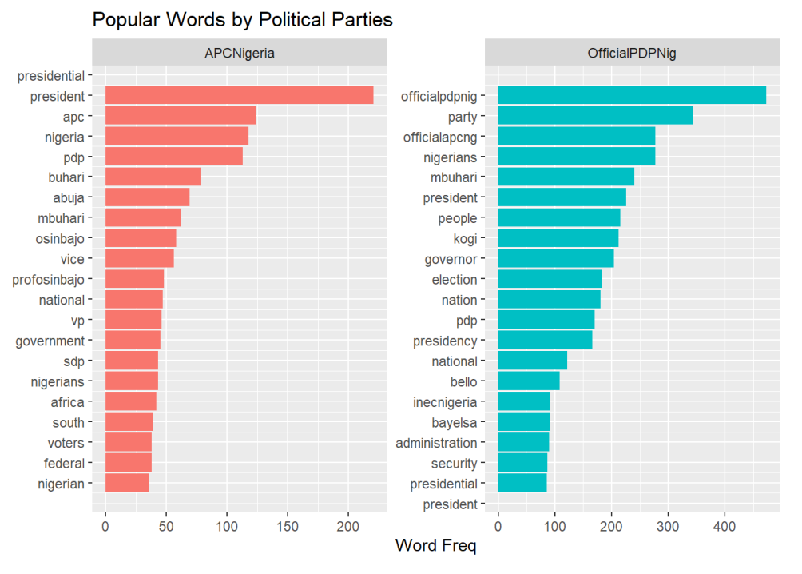
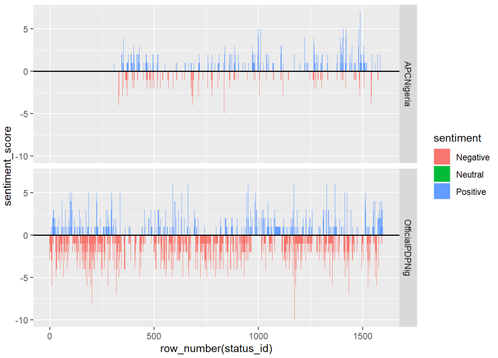
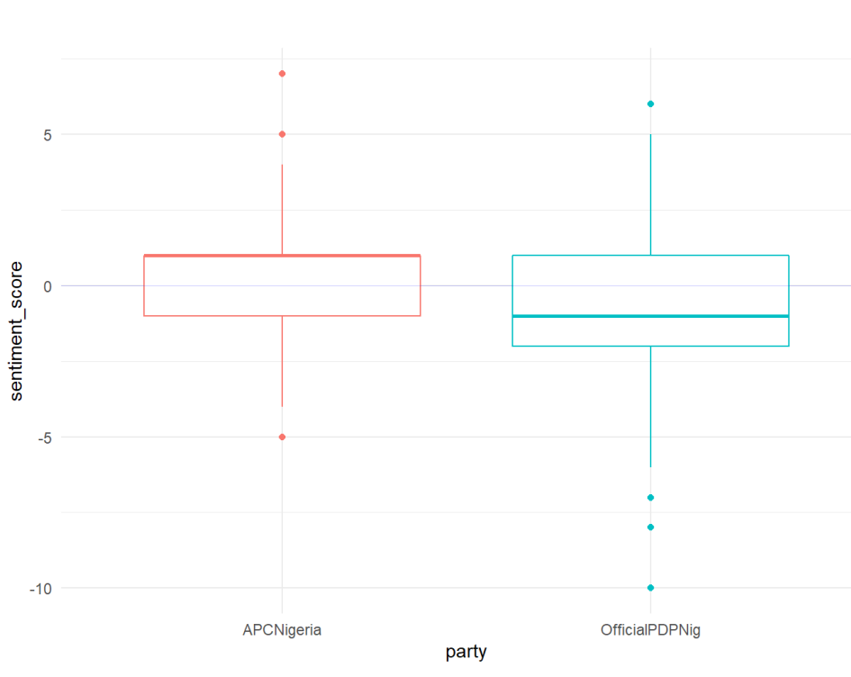

# Sentiment Analysis with R 
## An Introduction to Text Analysis

Sentiment Analysis with R using tidy principle - Persentation at Lagos R User Group 

### Highlight
- Scrapping Tweets using rtweet
- Tidy preprocessing - tidyverse
- Sentiment Analysis in R using _tidytext_ package

 

 

 

